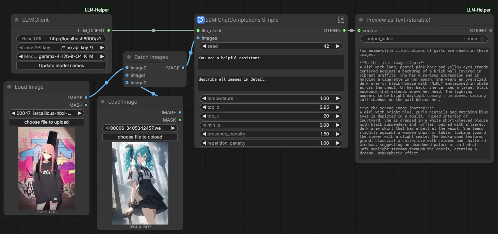
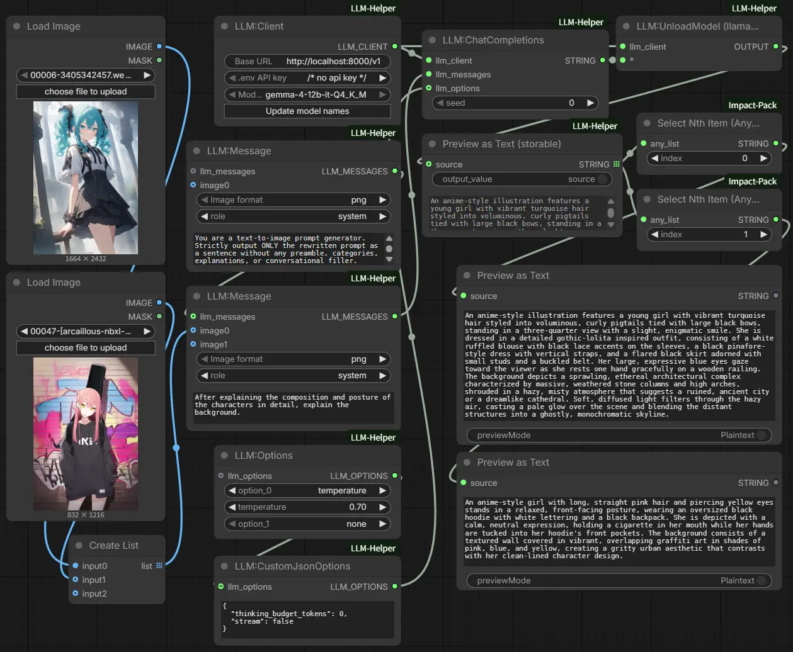

# ComfyUI LLM Helper

A collection of custom nodes for working with LLM APIs in ComfyUI.  
It supports everything from API client management to direct ChatCompletions execution and workflow utilities.

## Key Features

- **LLM Client & Execution:** Configure API servers securely and run ChatCompletions directly within ComfyUI.
- **Node Compatibility:** Unpack client data to use with other OpenAI-compatible custom nodes.
- **Workflow Utilities:** Supports streaming, automatic image handling for multimodal models, and storable text previews.

## Installation

```bash
cd ComfyUI/custom_nodes
git clone https://github.com/bedovyy/ComfyUI-LLM-Helper
cd ComfyUI-LLM-Helper
pip install -r requirements.txt
```
Or search and install `ComfyUI-LLM-Helper` on ComfyUI-Manager.

## Usage

### Simple ChatCompletions using blueprint



### ChatCompletions with list




## Nodes

### `LLM:Client`

- Set your LLM server's `base_url` and select API key from environment variables (loaded securely from `ComfyUI/.env`).
- Click **"Update model names"** to query the real /models endpoint and instantly refresh the `model_name` dropdown with available models, then use the outputs downstream.

### `LLM:UnloadModel (llama.cpp)`

- Sends an unload request to `llama-server` when running in **router mode**, freeing the model from memory.

### `LLM:Unpack client`

- Unpacks `base_url`, `api_key`, and `model_name` from the `LLM:Client` node. This allows these values to be used with other OpenAI API nodes.
> Caution: Be aware that the `api_key` is output as a plain string.

### `LLM:ChatCompletions`

- Sends a request via the OpenAI API `/chat/completions` endpoint. Requests are streamed by default, allowing you to monitor progress or interrupt the process within the node. (Streaming can be disabled by adding `stream: false` to `LLMCustomJsonOptions`.)

### `LLM:Message`

- Constructs messages to be sent to the LLM. In addition to `user`, `system`, and `assistant` roles, custom roles can be selected. When an image is provided as input, an image ID is automatically assigned.

### `LLM:Options`

- Allows specification of parameters such as `temperature` and `top_p`.

### `LLMCustomJsonOptions`

- Allows you to include additional request information by writing it in JSON format.

### `Preview as Text (storable)`

- Similar to `Preview as Text`, but saves the value within the workflow, allowing the stored value to be retrieved and reused.

### `LLM:ChatCompletions Simple` (subgraph blueprint)

- A subgraph blueprint that provides a basic configuration for entering system and user prompts.
